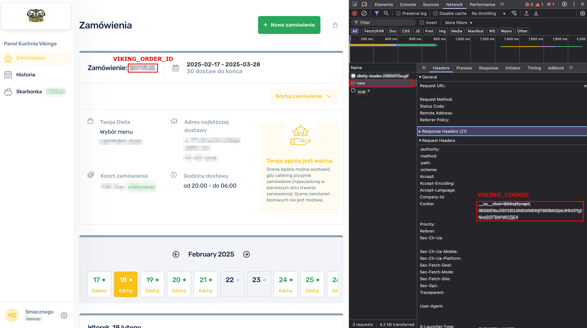
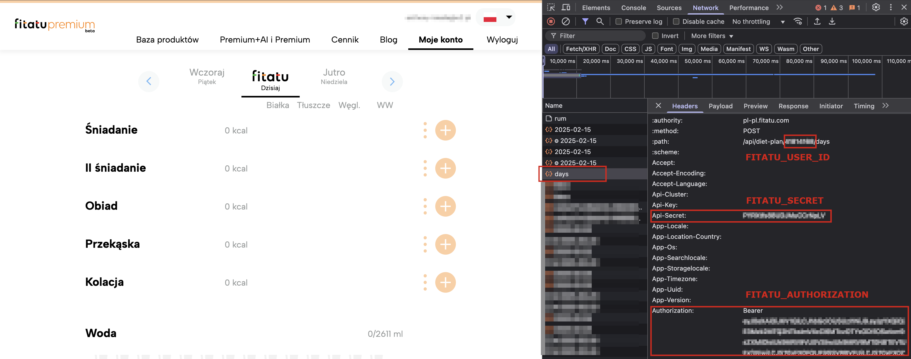
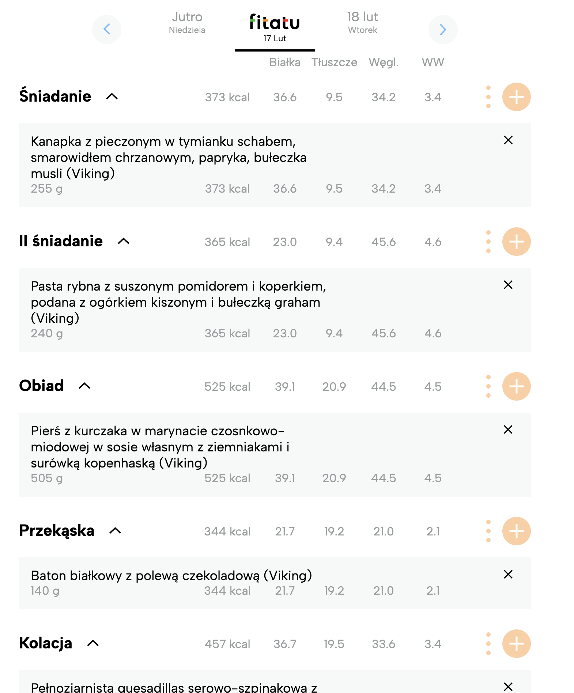

# Viking-Fitatu-Integration

A script to integrate Viking orders with Fitatu.

## Disclaimer

This script was created for personal use. Anyone is free to use it, but you are responsible for configuring it with your own data, credentials, and any modifications needed to fit your requirements. Use it at your own risk.

## Configuration

Create a `config.py` file in the same directory as the script with the following content:

```python
#TARGET_DATES = ["2025-02-14", "2025-02-15"]
TARGET_DATE_RANGE = ("2025-02-14", "2025-02-15")

# Meal Mapping Configuration (optional)
MEAL_MAPPING = {
   "Śniadanie": "breakfast",
   "II śniadanie": "second_breakfast",
   "Obiad": "dinner",
   "Podwieczorek": "snack",
   "Kolacja": "supper"
}

# Viking
VIKING_COOKIE = "__ca__chat=tbb...; SESSION=MzI3N..."
VIKING_ORDER_ID = 0000000  # Your order ID in Viking

# Fitatu
FITATU_USER_ID = 00000000  # Your user ID in Fitatu
FITATU_SECRET = "PYRX..."
FITATU_AUTHORIZATION = "Bearer eyJ0eXAiOiJKV1..."
```

### About TARGET_DATES and TARGET_DATE_RANGE

* TARGET_DATES: A list of specific dates in the format ["YYYY-MM-DD", "YYYY-MM-DD"]. You can use this if you want to provide a specific set of dates. This is an alternative to using TARGET_DATE_RANGE. You should not use both options at the same time.
* TARGET_DATE_RANGE: A tuple of two dates in the format ("YYYY-MM-DD", "YYYY-MM-DD"). This range of dates will be used to generate a list of dates between the start and end date, inclusive. This is useful when you want to generate dates automatically for a given range.

You can choose to use either TARGET_DATES or TARGET_DATE_RANGE, but not both. If both are provided, an error will be raised.

### Meal Mapping Configuration

In the config.py file, you can define a mapping for meal names to Fitatu meal types for exampe, when user does not have "Podwieczorek" in Viking, and does not have Breakfests in Fitatu:

```python
MEAL_MAPPING = {
    "Śniadanie": "lunch",
    "II śniadanie": "lunch",
    "Obiad": "dinner",
    "Kolacja": "supper"
}
```

#### Default Meal Mapping Configuration

If you prefer to use the standard configuration, you **do not need to modify** the `MEAL_MAPPING` dictionary. The default mapping is as follows:

```python
MEAL_MAPPING = {
    "Śniadanie": "breakfast",
    "II śniadanie": "second_breakfast",
    "Obiad": "dinner",
    "Podwieczorek": "snack",
    "Kolacja": "supper"
}
```

#### Custom Meal Mapping

You can customize the mapping if needed. The keys in MEAL_MAPPING represent the meal names in your Viking orders, and the values represent the corresponding meal types in Fitatu.

Valid meal types in Fitatu:

* "breakfast"
* "second_breakfast"
* "dinner"
* "lunch"
* "snack"
* "supper"

These values must match one of the predefined meal types in Fitatu.

### How to Retrieve Data for Configuration File

1. **Viking Credentials:** 
   - Obtain the `VIKING_COOKIE` by inspecting your session cookies after logging into Viking.
   - Find your `VIKING_ORDER_ID` in your Viking account/order history.



2. **Fitatu Credentials:**
   - `FITATU_USER_ID` can be found in your Fitatu account settings.
   - `FITATU_SECRET` and `FITATU_AUTHORIZATION` tokens are generated from Fitatu’s API or authentication system.



## Run the Script

Execute the following command in your terminal:

```sh
python3 viking_fitatu_integration.py
```

## Expected Output

Example output when running the script:

```sh
2025-02-16 21:16:47,884 - INFO - Selected date range: ('2025-02-21', '2025-02-21')
2025-02-16 21:16:47,884 - INFO - Processing 2025-02-21
2025-02-16 21:16:48,311 - INFO - Product 'Quesadilla z indykiem, papryką i mozzarellą z sosem czosnkowo-koperkowym' found with ID 0000000
2025-02-16 21:16:48,477 - INFO - Product 'Proteinowy shake egzotyczne owoce' found with ID 0000000
2025-02-16 21:16:49,263 - INFO - Marking 'Pasta jajeczna z polędwicą wieprzową i szczypiorkiem, bułeczka pszenna, pomidorki' as deleted
2025-02-16 21:16:49,264 - INFO - Added 'Śniadanie' with product ID 0000000 to diet plan
2025-02-16 21:16:49,264 - INFO - Skipping 'II śniadanie' - already exists in diet plan
...
2025-02-16 21:16:49,418 - INFO - Fitatu Diet Plan updated for 2025-02-2
```




## Requirements

Ensure you have Python 3 installed and all required dependencies set up before running the script. If needed, install dependencies using:

```sh
pip install -r requirements.txt
```

## License

This project is licensed under the MIT License.